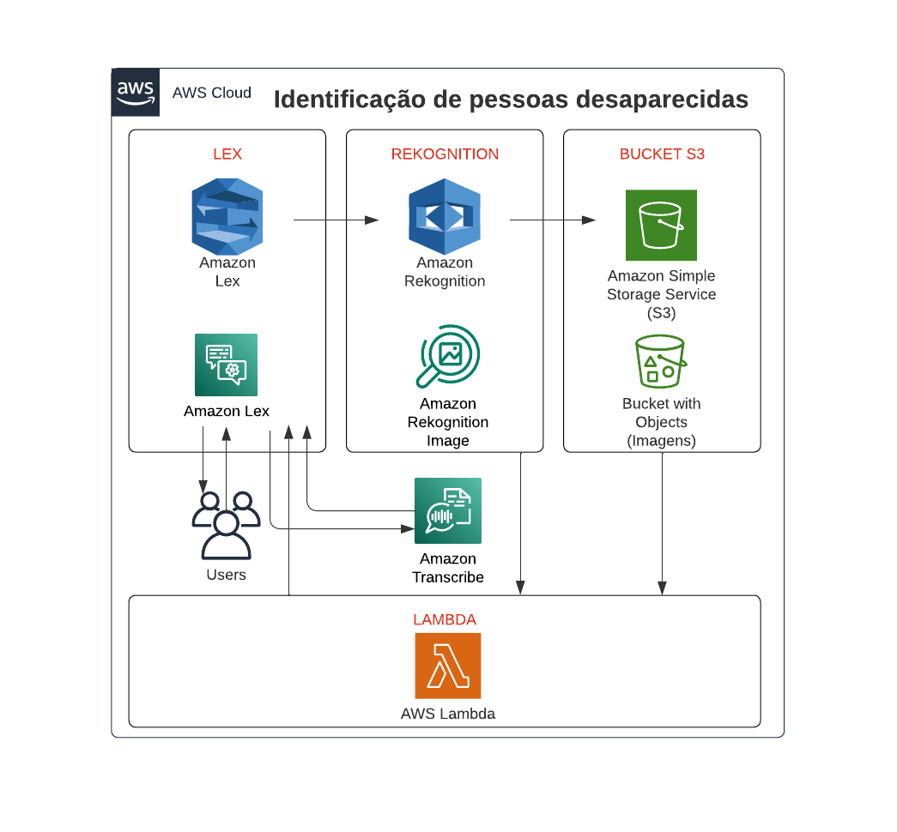

  

# 📑 Avaliação Sprint 10/11 - Programa de Bolsas Compass.uol / AWS e IFCE

## 📌 Tópicos 

- [👥 Equipe](#-equipe)
- [📝 Arquitetura e descrição do projeto](#-descrição-do-projeto)
- [💻 Ferramentas e tecnologias](#-ferramentas-e-tecnologias)
- [😌 Impedimentos resolvidos](#-impedimentos-resolvidos)
- [📂 Organização do código](#-organização-do-código)
- [📌 Considerações finais](#-considerações-finais)

## 👥 Equipe

### **Grupo 3**
- [Dayanne Bugarim](https://github.com/dayannebugarim) - [Luan Ferreira](https://github.com/fluanbrito) - [Mylena Soares](https://github.com/mylensoares) - [Tecla Fernandes](https://github.com/TeclaFernandes) - [Rosemelry Mendes](https://github.com/Rosemelry) - [Rangel Mello](https://github.com/Rangelmello)

## 📝 Arquitetura e descrição do projeto

### **Arquitetura**

---

### **Descrição**

Este projeto propõe a criação de um chatbot utilizando a tecnologia AWS Lex para auxiliar no processo de identificação de pessoas desaparecidas, servindo tanto para quem busca quanto para quem encontra alguém desaparecido. Através do chatbot, o usuário poderia enviar fotos, descrições físicas e outras informações úteis sobre essas pessoas (podendo ser através de texto e/ou áudio), afim de armazenar essas informações ou de buscar uma correspondência na base de dados. Também seria possível simular como seria a aparência da pessoa ao longo dos anos, isso ajudaria na indentificação de casos de desaparecimento mais antigos. O objetivo é utilizar tecnologias de reconhecimento facial como o Amazon Rekognition para comparar a foto enviada pelo usuário com as imagens de pessoas desaparecidas que estão armazenadas em um bucket S3, e também a [API Age Progression](https://replicate.com/yuval-alaluf/sam) para as simulações dos retratos com progressão de idade.

Para implementar esse projeto, serão utilizados os serviços da AWS Lambda, S3, Rekognition e Transcribe. O fluxo do projeto será o seguinte:

1. O usuário inicia uma conversa com o chatbot Lex enviando uma mensagem e tem a opção de enviar uma foto de uma pessoa desaparecida.

2. O chatbot recebe a mensagem e, se a opção de enviar a foto for selecionada, o chatbot envia a foto para o bucket S3.

3. Em seguida, a imagem é processada pelo serviço Amazon Rekognition para comparar a foto enviada com as imagens de pessoas desaparecidas que estão armazenadas no bucket S3.

4. Se uma correspondência for encontrada, o serviço Amazon Rekognition envia de volta informações e fotos da pessoa desaparecida, bem como a precisão de ser ou não a mesma pessoa.

5. A AWS Lambda é usada para executar o código personalizado para processar as informações recebidas e preparar a resposta para o usuário. 

6. O chatbot Lex envia a resposta para o usuário com informações sobre a pessoa desaparecida, como nome, idade, descrição, foto e locais em que a pessoa pode ser encontrada.

7. O usuário também pode gerar um retrato simulando a aparência da pessoa em uma certa idade.

Esse projeto é uma iniciativa importante, pois pode ajudar a encontrar pessoas desaparecidas, fornecendo informações valiosas aos usuários, e ao mesmo tempo, a utilização de tecnologias da AWS pode proporcionar uma solução escalável e confiável.

## 💻 Ferramentas e tecnologias
| Ferramentas e tecnologias             | Descrição                                                  |
|--------------------------|------------------------------------------------------------|
| AWS                      | Plataforma de computação em nuvem da Amazon.                  |
| Amazon Lex | Serviço para criar interfaces conversacionais em qualquer aplicação usando voz e texto. |
| Amazon Rekognition        | Serviço de análise visual baseado em aprendizado profundo. |
|Amazon S3                      | Serviço de armazenamento altamente escalável e durável que permite armazenar e recuperar dados de forma segura a partir de qualquer lugar da web. |
| Lambda                   | Serviço de computação serverless que permite a execução de código sem a preocupação de gerenciar servidores |
| Amazon Transcribe         | Serviço de reconhecimento automático de fala que usa modelos de aprendizado de máquina para converter áudio em texto. |

## 😌 Impedimentos resolvidos
Interpretação inicial da construção, organização do código como também de sua arquitetura.

Dificuldades na integração inicial do bot com as funcionalidades, interligadas a cada serviço.

## 📂 Organização do código
            

Uma boa organização do código é fundamental para evitar erros e bugs, pois permite a separação clara e identificação precisa de cada parte do código. Dessa forma, torna-se mais fácil detectar e corrigir problemas, além de facilitar a implementação de novas funcionalidades. Além disso, a organização do código pode aumentar a produtividade da equipe, uma vez que torna mais fácil a colaboração entre os membros e a revisão do código. A clareza e consistência da estrutura do código também podem ajudar a evitar mal-entendidos e conflitos durante o processo de desenvolvimento.

## 📌 Considerações finais
A utilização de tecnologias como AWS Lex, Amazon Rekognition e Age Progression para a criação de um chatbot de auxílio à identificação de pessoas desaparecidas é uma iniciativa inovadora e potencialmente impactante. Através da disponibilização de um meio mais acessível e intuitivo para o envio de informações sobre pessoas desaparecidas, esta ferramenta pode contribuir significativamente para a resolução de casos e para a redução do número de pessoas desaparecidas.
Em resumo, a criação de um chatbot para auxiliar no processo de identificação de pessoas desaparecidas, utilizando tecnologias de ponta, pode ser uma iniciativa valiosa e de grande impacto.
